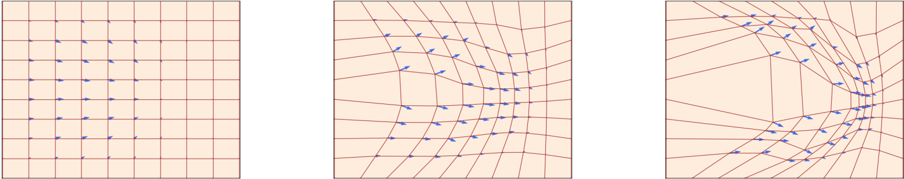

# Video Stabilization with Optical Flow and Deep Models

Coursework project on offline video stabilization using optical flow, robust global motion estimation, trajectory smoothing, and quantitative evaluation.

The project compares two motion-estimation backends inside the same stabilization pipeline:

- `lk`: sparse pyramidal Lucas-Kanade tracking
- `raft`: dense optical flow with RAFT

The main practical conclusion of the work is that, for this pipeline and hardware setup, Lucas-Kanade is the stronger stabilization backend on the main benchmark clip.

## Motivation

This coursework was motivated by two directions:

- My Multimedia Processing and Video Analysis university course
- the MIT course [6.S184: Generative AI with Stochastic Differential Equations](https://diffusion.csail.mit.edu/2026/index.html), especially its treatment of flow models, diffusion models, ODEs, and SDEs

The implementation itself is a video-stabilization system, not a diffusion model. The MIT material mainly informed the broader mathematical framing in the report.

## Flow Model Inspiration

<p align="center">
  
</p>

The broader mathematical framing of the coursework was also influenced by flow and diffusion models, especially the ODE/SDE viewpoint presented in the Introduction to Flow Matching and Diffusion Models 2026 MIT course.

## What The Project Contains

- offline stabilization in `stabilize.py`
- RAFT inference demo in `inference.py`
- repeatable parameter sweeps in `run_experiments.py`
- controlled degradation generation in `generate_degradations.py`
- robustness benchmarking in `run_degradation_benchmarks.py`
- plotting for report-ready figures in `plot_results.py`
- final written report in `report/build/main.pdf`

## Pipeline

For each pair of consecutive frames, the pipeline:

1. estimates motion with either `lk` or `raft`
2. fits a robust global affine camera transform with `RANSAC`
3. accumulates transforms into a camera trajectory
4. smooths the trajectory
5. warps frames to the corrected trajectory
6. evaluates residual motion on the final stabilized output

The system logs per-run metrics and per-frame trajectory data to CSV.

## Main Result

Primary benchmark clip:

- `car_input_20s.mp4`

Best overall result:

- backend: `lk`
- smoothing: `moving_average`
- `smooth_radius=30`
- `correction_strength=1.0`
- residual ratios: `ratio_x=0.555`, `ratio_y=0.145`, `ratio_rot=0.114`

Interpretation:

- about `44.5%` residual-motion reduction in `x`
- about `85.5%` residual-motion reduction in `y`
- about `88.6%` residual rotational-jitter reduction

Practical backend comparison:

- full-resolution RAFT was not feasible on the available GPU memory (NVIDIA RTX 4060 8GB)
- on the `0.5x` downscaled car clip, `LK` still outperformed `RAFT-small` in both speed and stabilization quality

## Demo Videos

Main benchmark videos:

<table>
  <tr>
    <td align="center"><strong>Car Input</strong></td>
    <td align="center"><strong>Best LK Result</strong></td>
    <td align="center"><strong>RAFT-small on 0.5x Input</strong></td>
  </tr>
  <tr>
    <td align="center">
      <a href="https://youtu.be/6i-tXz_Ya3w">
        
      </a>
    </td>
    <td align="center">
      <a href="https://youtu.be/JyWiXKElYgQ">
        
      </a>
    </td>
    <td align="center">
      <a href="https://youtu.be/64ikkmNRayA">
        
      </a>
    </td>
  </tr>
  <tr>
    <td align="center"><a href="https://youtu.be/6i-tXz_Ya3w">Watch on YouTube</a></td>
    <td align="center"><a href="https://youtu.be/JyWiXKElYgQ">Watch on YouTube</a></td>
    <td align="center"><a href="https://youtu.be/64ikkmNRayA">Watch on YouTube</a></td>
  </tr>
</table>

Important note:

- the RAFT video is not a full-resolution counterpart to the main car input; it is the best available RAFT result on the `0.5x` downscaled car clip

## Quick Start

### Clone With RAFT

This project depends on the official Princeton RAFT repository:

- <https://github.com/princeton-vl/raft>

If you clone this coursework repository, make sure the `RAFT/` dependency is also fetched.

Recommended:

```bash
git clone --recurse-submodules https://github.com/Apsie09/Video-Stabilization-Optical-Flow-RAFT.git
```

If you have already cloned the repository without submodules:

```bash
git submodule update --init --recursive
```

### Environment

For modern NVIDIA GPUs:

```bash
conda create -n raft-gpu python=3.10 -y
conda activate raft-gpu
python -m pip install --upgrade pip
python -m pip install torch==2.5.1 torchvision==0.20.1 --index-url https://download.pytorch.org/whl/cu121
python -m pip install -r requirements-gpu.txt
```

Or use:

```bash
./setup_raft_gpu_env.sh
```

### Run The Best LK Result

```bash
python stabilize.py \
  --motion_backend lk \
  --video ./videos/car_input_20s.mp4 \
  --output ./experiments/car_20s/car_input_20s_lk_moving_average_r30_cs1.mp4 \
  --smoothing moving_average \
  --smooth_radius 30 \
  --correction_strength 1.0 \
  --crop_margin 20
```

### Run A RAFT Example

```bash
python stabilize.py \
  --motion_backend raft \
  --model ./models/raft-sintel.pth \
  --video ./videos/crowd.mp4 \
  --output ./videos/crowd_stabilized.mp4 \
  --smoothing moving_average \
  --smooth_radius 15 \
  --crop_margin 20
```

## Report

The final report is available at:

- `A_Popov_CourseWork_Report.pdf`

The LaTeX source is:

- `report/main.tex`

## Acknowledgements

- RAFT source code by the Princeton Vision and Learning Lab:
  - repository: <https://github.com/princeton-vl/raft>
  - local dependency folder: `RAFT/`
- MIT 6.S184 course notes and materials on flow and diffusion models:
  - course page: <https://diffusion.csail.mit.edu/2026/index.html>
  - lecture notes: <https://diffusion.csail.mit.edu/2026/docs/lecture_notes.pdf>
